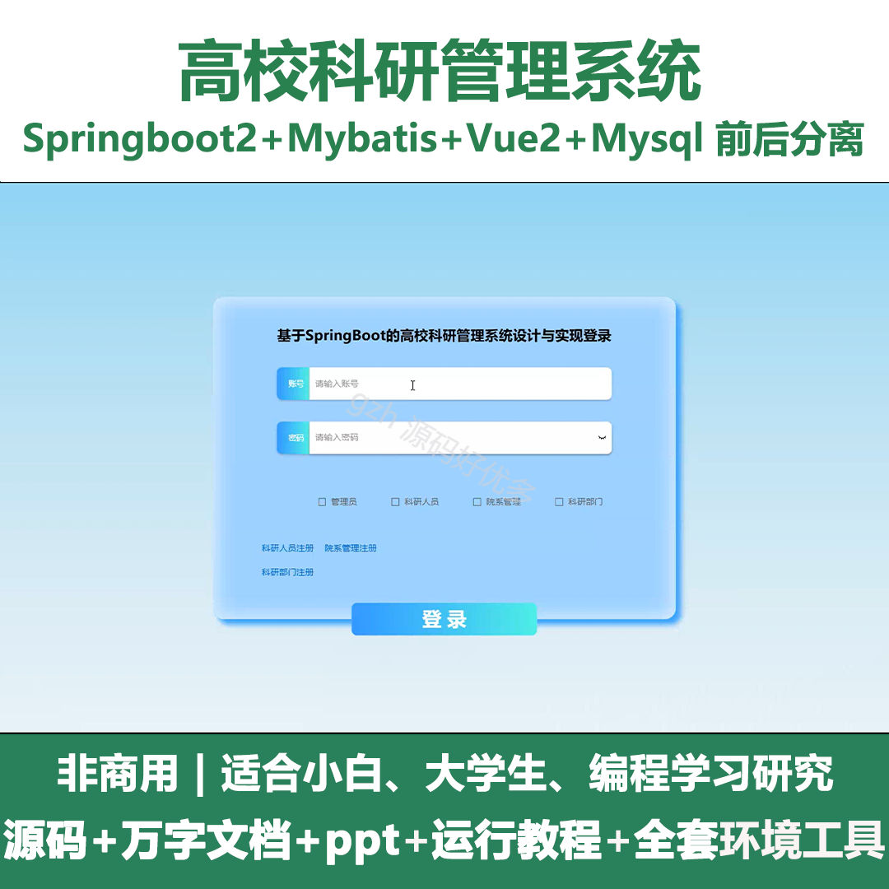
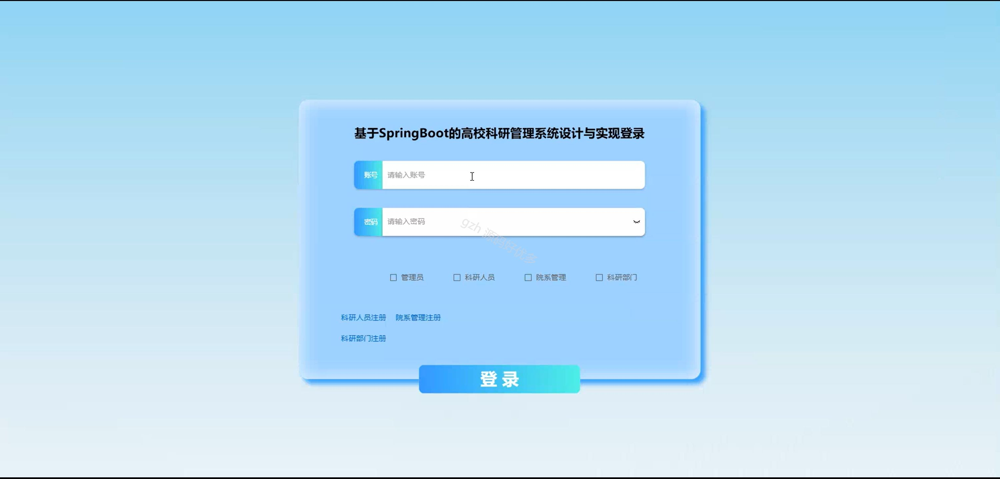
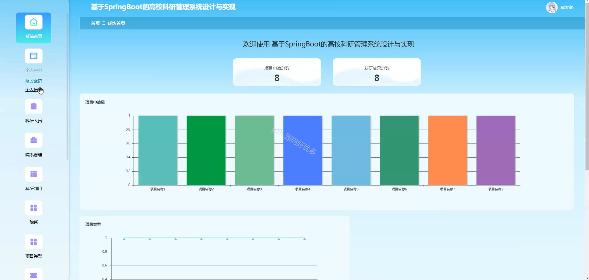
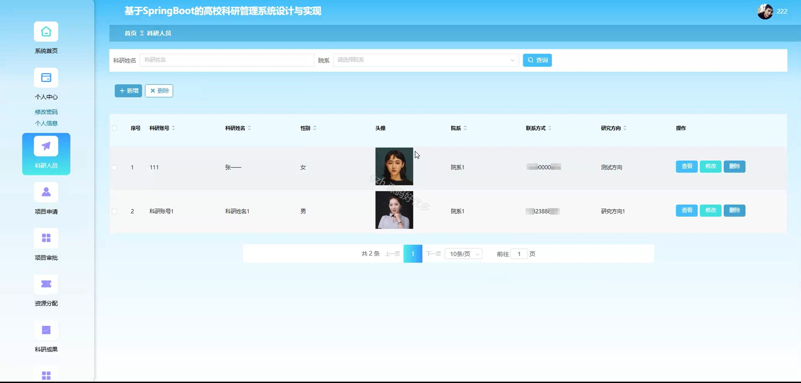
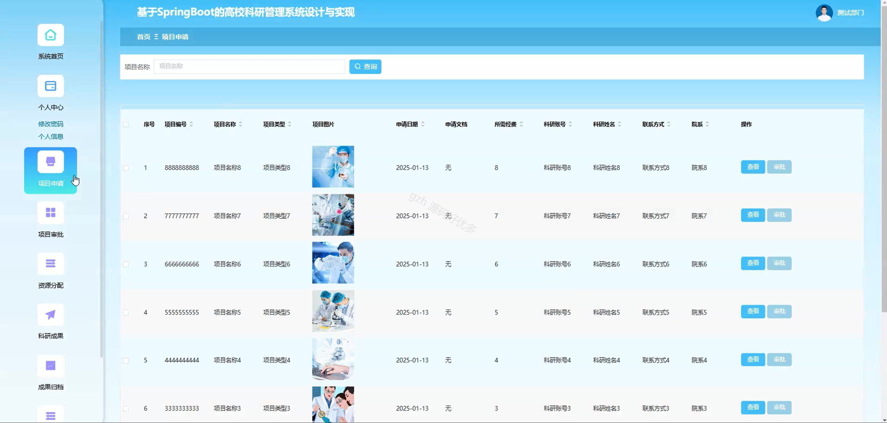
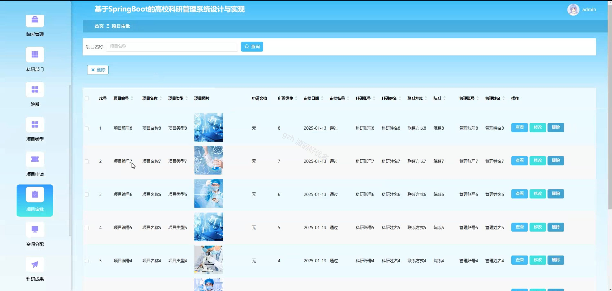
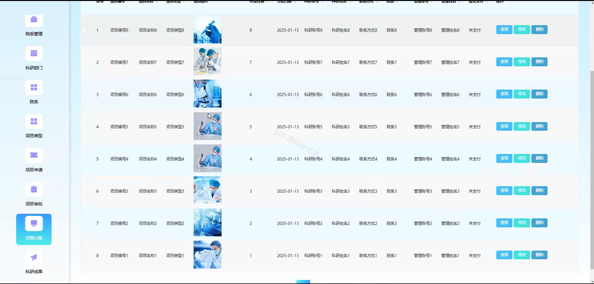
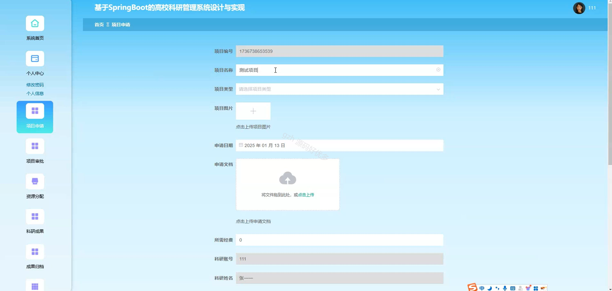
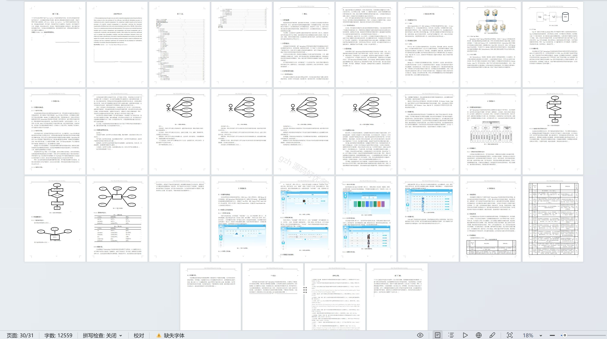

# springbootA289D
springbootA289D高校科研管理系统+LW+PPT
 
## 查看主页获取源码

### 一、关键词
科研人员、院系管理、科研成果

### 二、作品包含
源码+数据库+设计文档万字+ppt+全套环境和工具资源+本地部署教程

### 三、项目技术
前端技术：Html、Css、Js、Vue2.0、Element-ui 
后端技术：Java、SpringBoot2.0、MyBatis

### 四、运行环境（以下版本亲测，其他版本未知，请自测）
开发工具：IDEA/eclipse  + VSCODE

数据库：MySQL5.7（最低要5.7版本）

数据库管理工具：Navicat10以上版本

环境配置软件： JDK1.8 + Maven3.6.3

前端Nodejs：14

浏览器：谷歌浏览器

### 五、项目介绍
项目编号：springbootA289D

高校科研管理系统用于对高校科研活动中的项目等进行全流程一体化管理，提升科研管理效率与水平。

角色：管理员、科研人员、院系管理、科研部门

管理员：系统首页、个人中心、科研人员、院系管理、科研部门、院系、项目类型、项目申请、项目审批、资源分配、科研成果、成果归档、成果奖励、论文信息。

科研人员：系统首页、个人中心、项目申请、项目审批、资源分配、科研成果、成果归档、成果奖励、论文信息。

院系管理：系统首页、个人中心、科研人员、项目申请、项目审批、资源分配、科研成果、成果归档、成果奖励、论文信息。

科研部门：系统首页、个人中心、项目申请、项目审批、资源分配、科研成果、成果归档、成果奖励、论文信息。

### 六、运行截图

